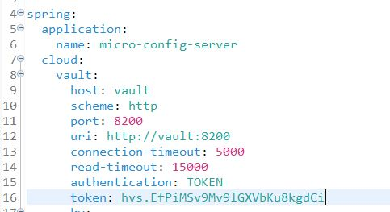
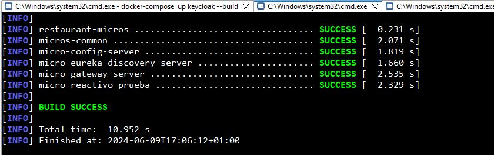
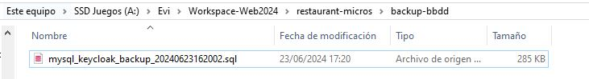
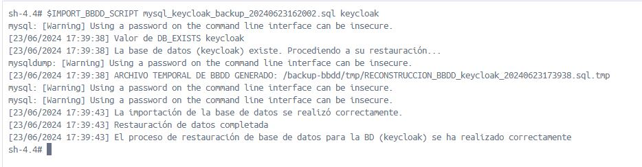
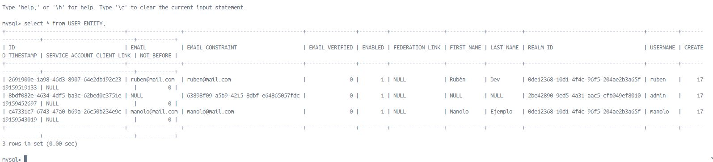
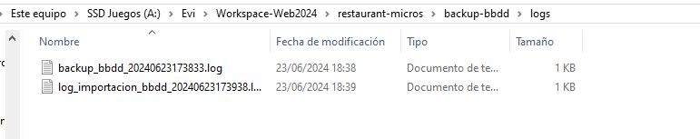

# Guía básica del desarrollador

En esta guía encontrará los conceptos fundamentales para entender la complejidad del proyecto desde el punto de vista del desarrollador.


## Arquitectura del proyecto

Proyecto Maven, conformado por un proyecto padre en el cual se especifican las características generales compartidas por todos los proyectos, como por ejemplo:

- Versión de proyecto
- Versiones de tecnologías utilizadas por el proyecto (ej: Spring Boot, Java, etc.)
- Codificación del proyecto
- Especificación de plugins de compilación


Se ha desarrollado un Docker Compose para la construcción del entorno y despliegue de la arquitectura del proyecto

### Compilación

Para compilar el proyecto y generar los JARS de los microservicios, es tan sencillo como ejecutar, desde la raíz del proyecto:

```bash
mvn clean install
```


### Construcción y despliegue con Docker Compose en entorno local

El despliegue consta de 3 partes:

1. Desplegar los servidores base fundamentales del proyecto (BBDD MySQL, Vault, Keycloak).

   Para ello, es tan sencillo como indicarle a Docker Compose que se debe desplegar el servidor Keycloak. En el caso de que también queramos construir el contenedor, será necesario incluir el parámetro `--build`

   ```bash
   docker-compose up keycloak --build
   ```

   En el Docker Compose se ha definido que para que se inicie el contenedor de Keycloak, primeramente los contenedores de MySQL y Vault deben encontrarse en un estado "healthy".

   Una vez ambos servidores se encuentren levantados y ejecutándose correctamente, se desplegará el servidor Keycloak.

2. Reemplazar el token de Vault en el `bootstrap.yaml` del `micro-config-server` *(OPCIONAL si no se reconstruye el contenedor Vault)*

   Esto es absolutamente necesario cada vez que se construya el contenedor Vault, en caso contrario puede omitir este paso.

   

   Se copia el `Root Token` y se incluye en el `bootstrap.yaml` del `micro-config-server`

   )

   Una vez realizado, se deben generar los JARS del proyecto para aplicar los cambios realizados (`mvn clean install`)

   

3. Construir y desplegar los microservicios

   ```bash
   docker-compose up --build
   ```

   En el caso de querer construir y desplegar un microservicio en concreto, bastaría con indicar su nombre

   ```bash
   docker-compose up micro-gateway-server --build
   ```


### Creación de copias de seguridad de BBDD e importación manual

El contenedor de MySQL está preparado para capturar la señal de apagado y, antes de proceder con el apagado, se ejecuta un script encargado de generar los respaldos de todas las bases de datos indicadas en el script.

Los respaldos se almacenan en un volumen, en este caso en `/backup-bbdd`.

Es importante mantener un histórico de las versiones de base de datos a modo de seguimiento y evolución del proyecto, además de facilitar el desarrollo y despliegue continuo, por lo que aquellos respaldos que el desarrollador considere valioso de mantener, lo podrá almacenar en `/mysql-server/sql/historical_bbdd`.

En caso de querer importarlo mediante el script  `/mysql-server/scripts/import_bbdd.sh`,  se deberá ubicar el `.sql` en este directorio.



Luego, accediendo a la shell del contenedor de mysql, puede realizar la importación mediante el siguiente comando.

```bash
$IMPORT_BBDD_SCRIPT <NOMBRE_FICHERO> <NOMBRE_BBDD>
```

`$IMPORT_BBDD_SCRIPT` --> es una variable de entorno referenciando la ubicación del script `(/usr/local/bin/import_bbdd.sh)`, el script puede recibir los 2 parámetros indicados o ninguno.

`<NOMBRE_FICHERO>` --> Nombre del fichero ubicado en la unidad de montaje (`/backup-bbdd`).

`<NOMBRE_BBDD>` --> Nombre de base de datos a recrear y reimportar datos.

En caso de no proporcionarle ningún parámetro, el script intentará realizar la importación de todas las bases de datos indicadas en el script, recogiendo el fichero cuya fecha en el nombre sea la más reciente.



Tras ejecutar el script, se verifica la correcta importación de la copia, que en este caso me brinda los usuarios registrados anteriormente en Keycloak.



A modo de depuración de errores, se generan logs en la unidad de montaje.



1. [Introducción General](#arquitectura-del-proyecto)