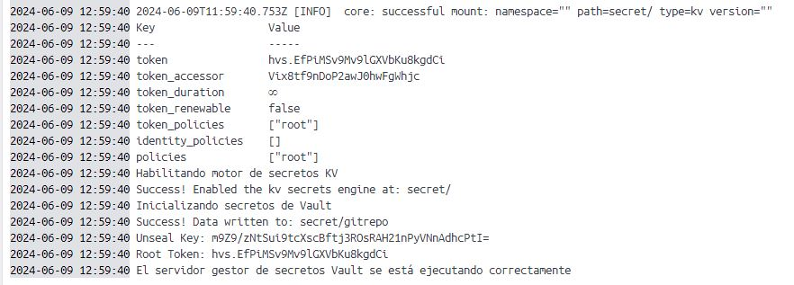

**Guía básica del desarrollador**

En esta guía encontrará los conceptos fundamentales para entender la complejidad del proyecto desde el punto de vista del desarrollador.


**Arquitectura del proyecto**

Proyecto Maven, conformado por un proyecto padre en el cual se especifican las características generales compartidas por todos los proyectos, como por ejemplo:

- Versión de proyecto
- Versiones de tecnologías utilizadas por el proyecto (ej: Spring Boot, Java, etc.)
- Codificación del proyecto
- Especificación de plugins de compilación


Se ha desarrollado un Docker Compose para la construcción del entorno y despliegue de la arquitectura del proyecto

**Compilación**

Para compilar el proyecto y generar los JARS de los microservicios, es tan sencillo como ejecutar, desde la raíz del proyecto:

```bash
mvn clean install
```


**Construcción y despliegue con Docker Compose en entorno local**

El despliegue consta de 3 partes:

1. Desplegar los servidores base fundamentales del proyecto (BBDD MySQL, Vault, Keycloak).

   Para ello, es tan sencillo como indicarle a Docker Compose que se debe desplegar el servidor Keycloak. En el caso de que también queramos construir el contenedor, será necesario incluir el parámetro `--build`

   ```bash
   docker-compose up keycloak --build
   ```

   En el Docker Compose se ha definido que para que se inicie el contenedor de Keycloak, primeramente los contenedores de MySQL y Vault deben encontrarse en un estado "healthy".

   Una vez ambos servidores se encuentren levantados y ejecutándose correctamente, se desplegará el servidor Keycloak.

2. Reemplazar el token de Vault en el `bootstrap.yaml` del `micro-config-server` *(OPCIONAL si no se reconstruye el contenedor Vault)*

   Esto es absolutamente necesario cada vez que se construya el contenedor Vault, en caso contrario puede omitir este paso.

   

   Se copia el `Root Token` y se incluye en el `bootstrap.yaml` del `micro-config-server`

   )

   Una vez realizado, se deben generar los JARS del proyecto para aplicar los cambios realizados (`mvn clean install`)

   

3. Construir y desplegar los microservicios

   ```bash
   docker-compose up --build
   ```

   En el caso de querer construir y desplegar un microservicio en concreto, bastaría con indicar su nombre

   ```bash
   docker-compose up micro-gateway-server --build
   ```

   